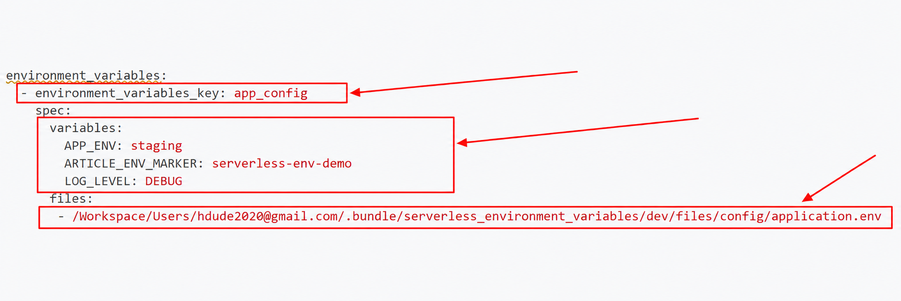
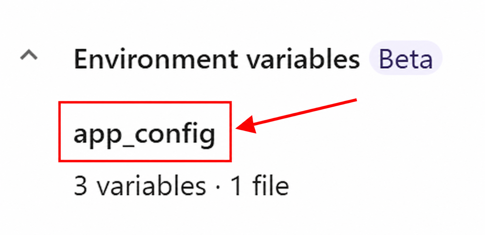
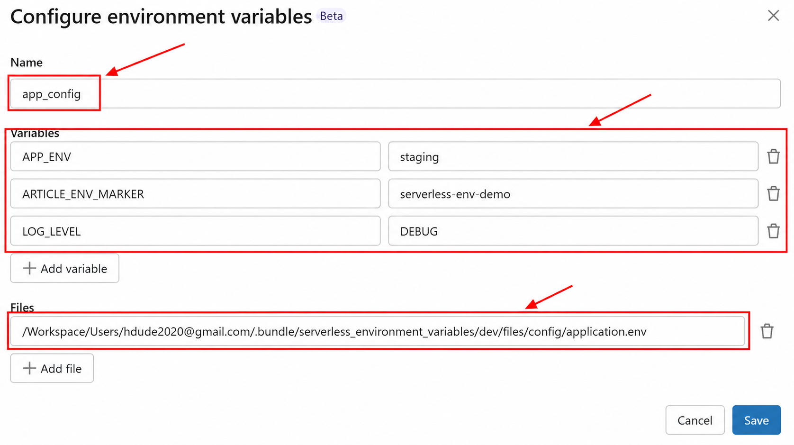
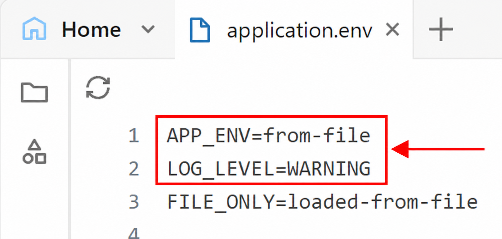
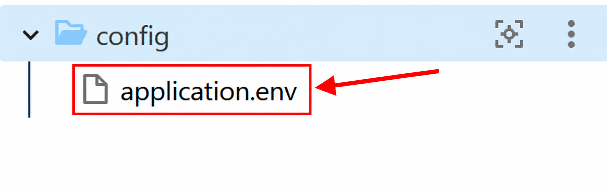

# Environment Variables in Databricks Serverless Jobs

## What are environment variables?

Environment variables are named text values available to a running program. They let us change settings such as `APP_ENV` or `LOG_LEVEL` without editing the application code. In Python, we read them with `os.environ` or `os.getenv`.

## Differences between classic and serverless

| Classic compute | Serverless jobs |
|---|---|
| Set variables in compute configuration, including `spark_env_vars`. | Define a named entry in the job and select it for each task. |
| Init scripts can prepare the environment. | Init scripts are unavailable. |

- Before this feature, one application-level option was to set `os.environ` in Python before importing code that needed it.
- The new option makes that setup part of the job configuration.
- The useful result: the same Python module can read its configuration locally and in a serverless job.

[Classic compute configuration](https://docs.databricks.com/aws/en/compute/configure#environment-variables)

## Current limitations

- **Beta:** a workspace administrator must enable the preview.
- Requires **serverless environment version 5 or later**.
- Maximum **10 entries per job**, **20 inline variables** and **5 files per entry**.
- Variables reach the task process, **not Spark UDFs**.
- One task selects one entry; entries do not inherit from each other.
- The job's **Run as** identity needs permission to read each file.

**DABs test, October 4, 2026:** CLI **v1.19.0** warned about the native fields and removed them from its resolved configuration. Validation still exited successfully. For this demo, deploy the notebooks and job with DABs, then enable UI editing and configure the entry. The [demo guide](README.md) includes the one-line unlock command. Check the entry and task assignments again after redeploying.

[Current serverless documentation](https://docs.databricks.com/aws/en/jobs/environment-variables) · [Our test results](evidence/results.md)

## YAML syntax

This is a **job settings fragment** showing the UI/API structure in YAML. It is a reference for the fields, not working native bundle configuration with the CLI version tested above.

```yaml
environment_variables:
  - environment_variables_key: app_config
    spec:
      variables:
        APP_ENV: staging
        LOG_LEVEL: DEBUG
      files:
        - /Workspace/Shared/application.env

tasks:
  - task_key: read_config
    notebook_task:
      notebook_path: /Workspace/Shared/01_simple
    environment_key: default
    environment_variables_key: app_config

environments:
  - environment_key: default
    spec:
      environment_version: "5"
```

- `environment_key` selects the task's serverless runtime environment.
- `environment_variables_key` selects the named collection of variables.
- Keep the entry's key and the task's selected key identical.
- Replace the example workspace paths with your deployed paths.



## What is `app_settings`?

- `app_settings.py` is an ordinary Python file we create in `src`.
- It keeps configuration reads in one place. It is not a special Databricks library or a `.env` loader.
- Other files import it instead of repeating the same configuration code.

```python
# src/app_settings.py
import os

APP_ENV = os.environ["APP_ENV"]
LOG_LEVEL = os.getenv("LOG_LEVEL", "INFO")
```

```python
# Another file in src
import app_settings

print(app_settings.APP_ENV)
print(app_settings.LOG_LEVEL)
```

- These assignments run when Python first imports the module.
- They store the values read at that time. Changing `os.environ` later does not automatically refresh them.
- This is why having the environment ready before the import matters.

## The UI: Name, Variables and Files

Select a job task and find **Environment variables**.



- **Name** identifies the whole entry, such as `app_config`. Several tasks can select it. It does not create a Python variable called `app_config`.
- **Variables** contains individual names and values, such as `APP_ENV=staging`.
- **Files** contains paths to `.env` files. You can use Variables, Files or both.



The file in this demo contains:

```dotenv
APP_ENV=from-file
LOG_LEVEL=WARNING
FILE_ONLY=loaded-from-file
```



- Files are read at task startup. Later files win over earlier files; inline values win over files.
- Our inline `APP_ENV=staging` and `LOG_LEVEL=DEBUG` therefore win. `FILE_ONLY` still comes from the file.
- Use plain `KEY=VALUE` lines. Quotes and `${OTHER}` remain literal text in this format.
- In the demo folder, `config/application.env` supplies values; `src/app_settings.py` reads the resulting process environment.



## Code examples

**Read a required value and an optional value:**

```python
import os

app_env = os.environ["APP_ENV"]  # Missing value raises KeyError.
log_level = os.getenv("LOG_LEVEL", "INFO")  # Default if absent.
print(app_env, log_level)
```

**Convert text into application settings:**

```python
import os

batch_size = int(os.getenv("BATCH_SIZE", "500"))
enable_export = os.getenv("ENABLE_EXPORT", "false").lower() == "true"
```

- Values start as strings. For example, `bool("false")` is `True`, so do not use it to parse a setting.
- The demo has five small notebooks: direct reads, importing `app_settings`, typed settings, the UDF boundary, and a task without an entry.
- The last two make the scope visible: the verified run returned no demo marker inside the UDF, and no custom demo values in the unassigned task.
- There are no deployment helper scripts. Start with `01_simple.py`, then open the examples you want to record.

## TL;DR

- Put deployment settings outside your Python code.
- Select a named entry for each task that needs it.
- Read settings directly or collect them in `app_settings.py`.
- Use the UI with the tested CLI version, and remember the Spark UDF boundary.
